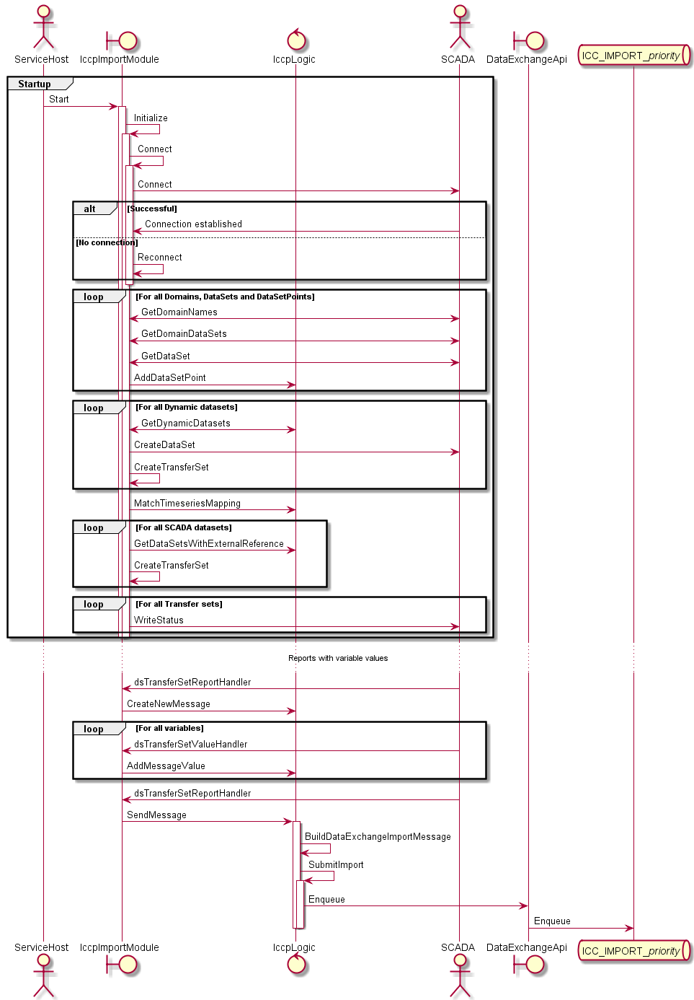

# Implementation description for the service implementing the ICCP/TAASE.2 interface.

This service handles modules for interfacing SCADA systems implementing the ICCP/TASE.2 protocol. Currently only an Import module (`IccpImportModule`) is implemented.
The interface is developed and supported by:

	Michael Zillgith, Software Consultant,
	T: +49 7681 2091980, 
	michael.zillgith@mz-automation.de 
	MZ Automation GmbH
	Bahnhofplatz 7 | D-79183 Waldkirch | Germany
	HRB 710995 | Amtsgericht Freiburg
	Geschäftsführer: Michael Zillgith
	www.mz-automation.de

The libraries `libtase2.NET.dll` and `tase2.dll` is placed in the Powel.NET/Icc/Messaging/DataExchangeManager/Dependencies folder.

## Adapting to a new version of libtase2.

Download a new package from https://mz-automation.atlassian.net/servicedesk/customer/portal/7

Extract the files to the Dependencies folder.

Follow the instructions in the README.md file for building a 32-bit version with Visual Studio.

Go to the build catalogue and open the libtase2.sln in Visual Studio and build a 32-bit Release version of the tase2.dll.

In the Services.sln, go to the Iccp* projects (currently IccpClient, IccpDataExchangeManagerService and IccpVolumeTestServer) and change the References for libtase2.NET (remove old and add new version).

Finally in the IccpDataExchangeManagerService project, add a link to the build\Release\tase2.dll library. This must be copied to iccruntime\bin* catalogue on newer version.

## The import module

The `IccpImportModule` is partly controlled by config parameters from the .config file (ConfigurationManager.AppSettings) and partly from parameters in a .json file. 
Parameters which is needed at startup is read from the ConfigurationManager, while parameters which can be changed while running is read from the .json file. The
latter one is supervised by a FileWatcher, and are loaded when changed. A locking mechanism is used to control that this does not happen in the middle of an import 
process.

At startup the module connects to the SCADA ICCP server, reads its data structure, matches the parameterised TimeserieMap and does an initialisation of one or more data set transfer set (DSTS). 
If no DSTSs are initialised the module stops.

Here is a sequence diagram showing the initialization process and the variables value report process.



At connect we fetch peer identity, supported features and VCC variables and data sets for debug info. Then we send our Identity fetched from the Reflection parameters
in the AssemblyInfo files. We also send our ApTitle and AeQualifier fetched from the .json parameter file. These are used for deciding access to data on the server 
side. If it is defined we also enable InformationMessages. These are logged in `Powel Event Log`.

The server data structure consists of Domains and Variables in a hierarchical structure. In addition to this, there is also a VCC scope/domain, and 
variables which belong to this scope are visible to all clients. We read out which domains, data sets and variables are declared on the server and if defined, 
writes them to the log file. We create an internal structure in the `IccpLogic` class with this information of domain/dataset/variable. There is also a separate tool `IccpClient`
which is a command line executable for requesting this information from the server.

The `TimeseriesMaps` parameter defines which variables/timeseries we want to import. This list defines which domain/dataset/variable shall be mapped to 
which time series in our import definition for the party/participant with EDIEL address: `IccpImport`. Since the ICCP protocol does not provide a value unit for 
the values, it is also possible to add a value unit in order to force value unit conversion during the import. If `UseDbTimeseriesMaps` is defined, then the time series map items
are created from the import definitions in the DB for a participant with BANKACC=`Hostname`. This requires that the external reference of the import definitions follows 
a pattern like `[domain].dataset.variable[.valueUnit]`. Elements in [] is optional and the delimiter is parameterized.

If the parameter `UseDynamicDatasets` is true, we define dynamic datasets containing variables from the `TimeseriesMaps` parameter that has a dataset attribute 
which is not predefined at the server.

For the rest of the server data structure we start matching the domain/dataset/variable with the information from the `TimeseriesMaps` parameter. 

For all domains/datasets which has time series external reference, we create a data set transfer set (DSTS). If there are no DSTS defined then the module stops. 
The DSTS are defined with parameters from the .json config file. The parameters are: `TransferSetIntervals`, `TransferSetReportIntegrityTimeout` and `TransferSetReportObjectChange`.

The values for the variables in the transfer sets are reported back using 2 different callbacks. One callback is used for start and end of a tranfer 
set report. At start of a transfer set report we lock the module so no parameters can be changed. We release this lock at end of the transfer set report. 
At start we also create a new `TimeSeriesContract` message instance. At each call on the second callback we update the `TimeSeriesContract` message with a new 
time series value. At end of a transfer set report: If the `TimeSeriesContract` message has one or more timeseries values, we send it. Either to the 
`ImportApplicationManagerService` by enqueing it to an ICC_IMPORT_\<priority\> queue or to the import application directly using the `ImportApplicationManagerLogic` 
(This is not recommended for this module since the ICCP server has no persistence on the server side). A priority for the `ImportApplicationManagerService` is 
set from the `Priorities` parameter which is a dataset indexed list.

<div hidden>
```
@startuml ImportModuleSequenceDiagram
actor ServiceHost as sh
boundary IccpImportModule as im
control IccpLogic as il
actor SCADA as scada
boundary DataExchangeApi as dea
queue "ICC_IMPORT_//priority//" as iq
group Startup
	sh -> im : Start
	activate im
		im -> im : Initialize
		activate im
			im -> im : Connect
			activate im
				im -> scada : Connect
				alt Successful
					scada -> im : Connection established
				else No connection
					im -> im : Reconnect
				end
			deactivate im
			loop For all Domains, DataSets and DataSetPoints
				im <-> scada : GetDomainNames
				im <-> scada : GetDomainDataSets
				im <-> scada : GetDataSet
				im -> il : AddDataSetPoint
			end
			loop For all Dynamic datasets
				im <-> il : GetDynamicDatasets
				im -> scada : CreateDataSet
				im -> im : CreateTransferSet
			end
			im -> il : MatchTimeseriesMapping
			loop For all SCADA datasets
				im -> il : GetDataSetsWithExternalReference
				im -> im : CreateTransferSet
			end
			loop For all Transfer sets
				im -> scada : WriteStatus
			end
		deactivate im
	deactivate im
end
... Reports with variable values ...
scada -> im : dsTransferSetReportHandler
im -> il : CreateNewMessage
loop For all variables
	scada -> im : dsTransferSetValueHandler
	im -> il : AddMessageValue
end
scada -> im : dsTransferSetReportHandler
im -> il : SendMessage
activate il
	il -> il : BuildDataExchangeImportMessage
	il -> il : SubmitImport
	activate il
		il -> dea : Enqueue
		dea -> iq : Enqueue
	deactivate il
deactivate il
@enduml
```
</div>

<div hidden>
To compile the PlantUML figures, download plantuml.jar and execute:
java -jar plantuml.jar ImplementationDescription.md
</div>
