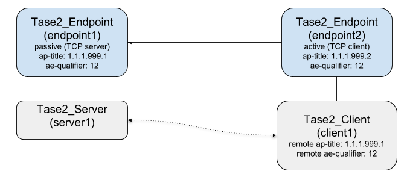
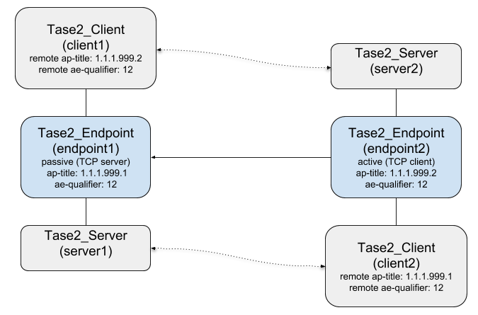

= TASE.2/ICCP Library Developer Guide: libtase2 Protocol Library Version 2.3
Copyright 2021 MZ Automation GmbH. All rights reserved.
:toc:
:sectnums:

== Introduction

This document is intended for TASE.2 application developers. It describes the basic principles to use the _libtase2_ TASE.2/ICCP protocol library to develop client, server, and dual-role applications. For more detailed information please have a look at the API reference manual and the example code.

TASE.2 (or ICCP) is a communication protocol based on MMS and TCP/IP. This protocol library uses MMS, but the user of this library doesn't need to be familiar with all MMS details in order
to use this library. However some basic knowledge of MMS can be helpful, e.g. when debugging
applications using wireshark.
The library follows an "object-oriented" design. The user handles objects (instances
of abstract data types) by using object specific access functions. The implementations
of the data structures are hidden. Even when accessible due to C language restrictions
the user should not use the data structures directly.

TASE.2/ICCP distinguishes between *client* and *server*. The client usually initiates services by
sending requests to the server. The server receives the requests and after evaluation initiates some internal processes and sends a response to the client. A TASE.2 application can either be a server, a client, or can even implement both roles at the same time.

In TASE.2 there is a conceptual distinction between *operations* and *actions*. Operations are
always initiated by client requests while actions are caused by some server internal state changes or external triggers at server side.

The most important data types of the library are

* *Tase2_Endpoint* that implements an TASE.2 communication endpoint. The endpoint can be _passive_ (TCP server) or _active_ (TCP client). An endpoint can have one or more dedicated _Tase2_Client_ and at most one dedicated _Tase2_Server_ instance.
* *Tase2_Client* that implements the client side to invoke TASE.2 services of a server
* *Tase2_Server* that implements the TASE.2 services on top of the MMS protocol library
* *Tase2_DataModel* that implements the device model of the TASE.2 server (each _Tase2_Server_ instance has a dedicated _Tase2_DataModel_ instance.
* *Tase2_BilateralTable* that specifies the access rights to a servers' data model and services (bilateral table - BLT). A server usually has a dedicated BLT for each associated client.

== Migration from older versions

=== Migration from version 2.0

There are a few places were the API changed and you have to change your code accordingly.

==== Tase2_Endpoint_Connection object

For the functions _Tase2_Endpoint_Connection_getPeerIpAddress_ and _Tase2_Endpoint_Connection_getPeerIpAddress_ the memory allocation for the returned strings changed.

Prior to version 2.1.0 the strings were allocated when the function was called and
had to be released by the caller of the function. Starting from version 2.1.0 the strings are
allocated when the function is called the first time and are released when the _Tase2_Endpoint_Connection_ object is destroyed. Usually you get a _Tase2_Endpoint_Connection_ object as an argument of a callback function. It is important not to use any of the functions
outside the callback! Otherwise the object might no longer exist and accessing the functions may
cause a memory corruption.

When using the .NET or Java API you don't have to care about this as the it is handled by the API.

=== Migration from version 2.1 or older

When you migrate from an older version (prior to version 2.2) it is important to know that the application layer addresses (like AP-title, AE-qualifiers) are checked more rigidly. That means a setup that formerly worked because libtase2 didn't check all the addressing details might no longer work because libtase2 now checks both the calling and called addresses. This was required when allowing multiple servers on a passive endpoint as the called address is required to identify the correct server instance.

== General considerations

Usually the data transfer from a server to a client is done by *transfer sets*. For the measurement and status data data set transfer sets (DSTS) are used. Transfer sets provide a mechanism for automatic data transfer. The client doesn't have to poll the data points because the server will automatically send new data when a data point changes or on a periodic base.

Data set transfer sets are used to transfer the data of a *data set*. The data sets can either be predefined by the server or the client can create the data set after connection by online services. The data sets created by online services are called _dynamic data sets_.

The server provides for each domain a number of DSTSs. These transfer sets can be reserved by the client with the _getNextDSTransferSet_ service. The client can then configure the transfer set parameters (transfer conditions, timeouts, period, ...) and then enable the transfer set.

So in general the process can look like below:

* the client connects to the server
* the client reserves a transfer set by the _getNextDSTransferSet_ service
* the client creates a data set with the required indication points and protection equipment data points
* the client assigns the new data set to the transfer set
* the client enables the transfer set
* the server send the data set data to the client on events or periodically

If required a client can use different transfer sets (e.g. if you need different period times for different kind of data).

Data transfer from a client to a server usually consists of sending commands or set points. The receiver of the commands and set points are *devices*. Devices are part of the server data model.

A TASE.2 application can also be client and server at the same time to use the transfer mechanisms in both directions.

CAUTION: Be cautious when using library functions in library callbacks or any code that is called in library callbacks. This can lead to dead lock situations. Don't use any function that affects a _Tase2_Client_, _Tase2_Server_, or _Tase2_Endpoint_ object in a callback. To be safe don't use any library functions in callbacks.

== Supported features

The following features are supported by the library:

* Indication points
* Protection equipment
* Device model (control)
* Data sets (get/set/create/delete/get directory)
* DS Transfer Sets (interval, RBE, ...)
* IM Transfer Sets (information messages)
* Multiple domains
* Bilateral Tables
* secure (TLS) or unsecure connections
* Conformance blocks 1, 2, 4, and 5
* bi-directional(dual-role) active and passive connections
* passive endpoints can handle multiple server instances
* C level API to directly use the native library
* All features are also available in the .NET and Java wrapper APIs

== Setting up an endpoint instance

For a generic TASE.2 application the first step is to setup and configure a *Tase2_Endpoint*
instance. An endpoint can be a _passive_ (TCP server) or _active_ (TCP client) communication endpoint.
An endpoint instance is created by the _Tase2_Endpoint_create_ function. One parameter indicates if the endpoint is passive, the other parameter contains the optional TLS configuration. If no
TLS is to be used you should pass a NULL pointer here.

In some cases it is not required to create the _Tase2_Endpoint_ instance manually. In the following two cases the _Tase2_Endpoint_ instance is created automatically:

* the _Tase2_Client_ is created with the _Tase2_Client_create_ function. This function implicitly creates an active _Tase2_Endpoint_ instance.
* the _Tase2_Server_ is created with the _Tase2_Server_create_ function. This function implicitly creates a passive _Tase2_Endpoint_ instance.

In library versions prior to 2.0 there where only these two functions to create endpoints and the
_Tase2_Endpoint_ class was not available. A client was always connected with a dedicated active endpoint and a server was always connected with a dedicated passive endpoint. Starting from version 2.0 more flexible configurations are possible including configuration that have a _Tase2_Client_ and a _Tase2_Server_ connected with the same endpoint ("dual-role" or "bi-directional" endpoints).

[#img-single-role-endpoints]
.Default configuration: two single role endpoints. Server uses passive endpoint and client uses active endpoint.

For more flexible setups (e.g. TASE.2 server with active endpoint, TASE.2 client with passive endpoint, or dual-role setups) you have to create the _Tase2_Endpoint_ instance manually.

[#img-dual-role-endpoints]
.Configuration with two dual-role endpoints. The dotted lines are the logical connections between clients and servers.

=== Configuration of the endpoint

The following code example shows how to create a dual-role passive endpoint. First the
_Tase2_Endpoint_ instance will be created and a local application reference will be assigned with the function _Tase2_Endpoint_setLocalApTitle_. 

Then a server is created with the _Tase2_Server_createEx_ function that accepts an _Tase2_Endpoint_ as argument. This function automatically associates the new server instance with the endpoint instance.

After that a client is created with the _Tase2_Client_createEx_ function that also automatically assigns the new client to the endpoint. A remote application reference is assigned to the client with the _Tase2_Client_setRemoteApTitle_ function. Here this means that whenever a remote TASE.2 endpoint connects to the local endpoint it will be connected to this client instance when the remote application reference (or depending on the configuration other addressing parameters) matches with the configured ones of the client.

[[app-listing]]
[source, c]
.Create a passive (TCP server) dual role endpoint
----
/* Create a passive endpoint (no TLS) */
Tase2_Endpoint endpoint = Tase2_Endpoint_create(NULL, true);
Tase2_Endpoint_setLocalApTitle(endpoint, "1.1.1.999.1", 12);

/* The single server instance is using the default local AP-title, AE-qualifier of the endpoint */
Tase2_Server server = Tase2_Server_createEx(dataModel, endpoint);

Tase2_Client client = Tase2_Client_createEx(endpoint);
Tase2_Client_setRemoteApTitle(client, "1.1.1.999.2", 12);
----

When using multiple servers with the same passive endpoint every server has to have its own local application addresses. These can be set using the _Tase2_Server_setLocalAddresses_ function. When this function is not used then the default local address of the server is the address set for the endpoint with _Tase2_Endpoint_setLocalApTitle_.

It is also possible to remove a client or server during runtime from an endpoint instance using the _Tase2_Endpoint_removeServer_ or _Tase2_Endpoint_removeClient_ functions.

After removing the client or server instances can be released with the _Tase2_Server_destroy_ or _Tase2_Client_destroy_ functions.

It is also possible to move a server instance from one passive endpoint to another passive endpoint:

[[app-listing]]
[source, c]
.Move a server from one passive endpoint to another passive endpoint
----
Tase2_Endpoint_removeServer(passiveEndpoint1, server1);

Tase2_Endpoint_addServer(passiveEndpoint2, server1);
----

NOTE: A server can not be added to multiple endpoints at the same time!

=== The addressing parameters used by TASE.2

Next to the TCP/IP layer addresses (IP address and TCP port) there are specific address parameters used by TASE.2/MMS for the upper protocol layer. Actually each protocol layer has its own address.

* ACSE: application reference (AP-title and AE-qualifier)
* ISO presentation layer: P selector
* ISO session layer: S selector
* ISO transport layer: T selector

Usually the AP-title and AE-qualifier are important. They are used by default by the protocol stack to associate clients with servers. Also they are used to associate bilateral tables to connected clients which is important to implement the access control properly.

The AP-title is an ITU object identifier (OID). It consists of a sequence of numbers separated by dots. The AE-qualifier is a single integer value. You can set these parameters by the _setLocalApTitle_ and _setRemoteApTitle_ functions of _Tase2_Endpoint_, _Tase2_Server_, and _Tase2_Client_.

The lower layer parameters (P, S, T selectors) are usually preset by some common default values and are usually not checked by the library in order to avoid interoperability problems. Yet in some cases (depending on the implementation of the peer device) it might be required to ensure that specific parameters are used.

E.g. you can set the local lower layer parameters by the _Tase2_Endpoint_setLocalAddresses_ function.

You can also change the parameters that are used for address matching (associating connection with client and server instances) by using the _Tase2_Endpoint_setAddressMatchingRules_ function.

=== Configuring TLS (optional)

This step is optional and only required for secure (encrypted and authenticated) communication.

The TLS configuration represented by a *TLSConfiguration* object. A new TLS configuration can be created with the _TLSConfiguration_create_ function:

  TLSConfiguration tlsConfig = TLSConfiguration_create();

Some validation parameters can be enabled or disabled. In the following example all
certificates are accepted that can be validated by one of the installed CA certificates:

  TLSConfiguration_setChainValidation(tlsConfig, false);
  TLSConfiguration_setAllowOnlyKnownCertificates(tlsConfig, false);

The following function calls are required to load the private key, server certificate, and
at least one CA certificate for chain validation:

  TLSConfiguration_setOwnKeyFromFile(tlsConfig, "server-key.pem", NULL);
  TLSConfiguration_setOwnCertificateFromFile(tlsConfig, "server.cer");
  TLSConfiguration_addCACertificateFromFile(tlsConfig, "root.cer");

=== Starting and stopping the endpoint

The _Tase2_Endpoint_ is started by calling the _Tase2_Endpoint_connect_ function. In case of an active endpoint this will cause the protocol stack to open a TCP connection to a remote TCP server. In case of a passive endpoint this will cause the protocol stack to listen for incoming TCP connections on a local TCP port.

The _Tase2_Endpoint_connect_ function is an asynchronous function. It will invoke the connection process and then will return. After calling the function you can check the current endpoint state by the _Tase2_Endpoint_getState_ function. This will return the current state.

E.g. example in case of an passive endpoint the state will be _TASE2_ENDPOINT_STATE_LISTENING_ when the endpoint is listening for incoming client connections. If there had been a problem the state will be _TASE2_ENDPOINT_STATE_ERROR_.

In case of an active endpoint the state after calling the _Tase2_Endpoint_connect_ function can either be _TASE2_ENDPOINT_STATE_CONNECTING_,  _TASE2_ENDPOINT_STATE_CONNECTED_, or _TASE2_ENDPOINT_STATE_ERROR_.

To simplify programming you can used the _Tase2_Endpoint_waitForState_. This function will block until a specified state is reached or a time out occured. It will return true if the expected state has been reached or false in case of a time out or error.

The endpoint connections can be closed (and listening to new connection be stopped) with the _Tase2_Endpoint_disconnect_ function.

[[app-listing]]
[source, c]
.Starting and stopping a passive endpoint
----
Tase2_Endpoint_connect(endpoint);

if (Tase2_Endpoint_waitForState(endpoint, TASE2_ENDPOINT_STATE_LISTENING, 1000)) {

	...

	Tase2_Endpoint_disconnect(endpoint);
}
----

== Configuring a server instance

A server is represented by a *Tase2_Server* instance. A server represents a data model, data sets, and transfer sets.
In order to setup the server the following steps are required:

* Create the TASE.2 data model and transfer sets
* Create the bilateral tables to control the access rights for clients
* OPTIONAL: Setup the TLS configuration - depending on the setup this has to be done when configuration the _Tase2_Endpoint_.
* Create and configure a _Tase2_Server_ instance

=== TASE.2 server data model

The server data model is represented by an instance of *Tase2_DataModel*. The data model
consists of domains, indication points, protection equipment data points, devices (control points),
data sets, and transfer sets. The data model object can be created by the _Tase2_DataModel_create_ function:

  Tase2_DataModel dataModel = Tase2_DataModel_create();

In TASE.2 variables are named objects that are part of the address space of the server.
Variables can be system variables (like "Bilateral_Table_ID", "Supported_Features", ...),
indication points, protections equipment, and devices.

Variables can have two "scopes". The _VCC scope_ or _domain specific (ICC)_ scope. Variables of
_VCC scope_ are not part of any TASE.2 domain and are visible to all clients.

Variables of _VCC scope_ are identified by the _variable name_ only. Variables of _domain scope_ are
identified by the _domain name_ and the _variable name_.

A TASE.2 domain is represented by a *Tase2_Domain* object. The domain object can hold all
kind of data points, data sets, and transfer sets. To create a new domain with a specific domain name
the _Tase2_DataModel_addDomain_ function has to be used:

  Tase2_Domain icc1 = Tase2_DataModel_addDomain(dataModel, "icc1");

The new domain will be added to the data model. The return value is a reference to
the newly created domain. It should be stored for further usage.

Despite of the fact that
VCC specific variables are not part of a domain, for implementation purposes they are
associated with a specific _Tase2_Domain_ instance. This instance is part of the *Tase2_DataModel* object
by default and can be accessed by the _Tase2_DataModel_getVCC_ function.

  Tase2_Domain vcc = Tase2_DataModel_getVCC(dataModel);

This function returns a _Tase2_Domain_ instance that represents the VCC.

Now data points can be added to the domains and the VCC "domain" with the _Tase2_Domain_addIndicationPoint_,
_Tase2_Domain_addControlPoint_, and _Tase2_Domain_addProtectionEquipment_ functions.

NOTE: Data point (or variable) names can only consist of alphanumeric ASCII characters (a-z, A-Z, 0-9) and the underscore ("_") sign.
All other characters are not allowed an can cause problems during operation.
The suffixes "_SBO" and "_TAG" are also not allowed as data point names (for indication points, devices, or protection equipment)
as these suffixes are reserved for protocol internal variables!

==== Setting the TASE.2 version

It is sometime required To explicitly set the TASE.2 version used by the server. This can be done with the function _Tase2_DataModel_setEdition_ with one of the values of the *Tase2_Edition* enumeration.

  Tase2_DataModel_setEdition(dataModel, TASE2_EDITION_1996_08)
  
The above function call sets the TASE.2 version for the data model to the version 1996.08 of the standard. The default version is 2000.08.

The TASE.2 version can be set individually for each Tase2_DataModel instance and is used by the Tase2_Server using the data model.

==== Adding indication points

TASE.2 supports different types of indication points. The simplest version are simple state (e.g. on/off), discrete (integer),
or float (real) values. Optionally an indication point can have

* a quality field that consists of up to eight quality flags
* a time stamp (normal or extend) field that can represent seconds or milliseconds timestamps
* a COV (counter of value changes) field

The following basic types are supported:

* State (_TASE2_IND_POINT_TYPE_STATE_)
* State supplemental (_TASE2_IND_POINT_TYPE_STATE_SUPPLEMENTAL_)
* Discrete (_TASE2_IND_POINT_TYPE_DISCRETE_)
* Real (_TASE2_IND_POINT_TYPE_REAL_)

Example (adding new variable with name "Real1" to the domain "icc1"):

  Tase2_Domain_addIndicationPoint(icc1, "Real1", TASE2_IND_POINT_TYPE_REAL, TASE2_NO_QUALITY, TASE2_NO_TIMESTAMP, false, true);

==== Adding protection equipment

Protection equipment data points are special data points that are related to protection events (like start or trip). They have one (class = single) or more (class = packed) state values, some flags, an event time, and a duration time.

To add protection equipment data points to the data model you need to use the _Tase2_Domain_addProtectionEquipment_.

Example:

  Tase2_Domain_addProtectionEquipment(icc1, "Protect1", false);

==== Adding device models (control points)

There are three different types of control points:

* Commands (_TASE2_CONTROL_TYPE_COMMAND_)
* Discrete setpoints (_TASE2_CONTROL_TYPE_SETPOINT_DESCRETE_)
* Real setpoints (_TASE2_CONTROL_TYPE_SETPOINT_REAL_)

Also there are two control classes:

* *Select-before-operate* (_TASE2_DEVICE_CLASS_SBO_). In this mode, first the client has to send a "select" message to "arm" the control point. When selected the client has to send an "operate" message before the select timeout.
* *Direct* (_TASE2_DEVICE_CLASS_DIRECT_). In this mode, the control consists of sending a simple "operate" command.

Example:

    Tase2_Domain_addControlPoint(icc1, "Command1", TASE2_CONTROL_TYPE_COMMAND, TASE2_DEVICE_CLASS_SBO, true, 1365);

==== Adding data sets and data set transfer sets

Data sets are list of variables (system variables and data points) that can be read or written with
a single read or write request by the client. They are also the base for DS transfer
sets.

A data set can contain the following system variables (of domain scope):

.System variables for DS transfer sets
[width="90%",cols="2*",frame="topbot",options="header"]
|===
| Name | Description
| Transfer_Set_Name | The name of the associated transfer set (consists of domain name and transfer set name)
| DSConditions_Detected | Conditions that caused the transfer set report
| Event_Code_Detected | The event code of the report
| Transfer_Set_Time_Stamp | The transfer set timestamp in seconds since epoch
|===

[[app-listing]]
[source, c]
.Add a new data set
----
Tase2_DataSet ds1 = Tase2_Domain_addDataSet(icc1, "ds1");

Tase2_DataSet_addEntry(ds1, icc1, "Transfer_Set_Name");
Tase2_DataSet_addEntry(ds1, icc1, "DSConditions_Detected");
Tase2_DataSet_addEntry(ds1, icc1, "Event_Code_Detected");
Tase2_DataSet_addEntry(ds1, icc1, "Transfer_Set_Time_Stamp");
Tase2_DataSet_addEntry(ds1, vcc, "VCCDiscrete1");
Tase2_DataSet_addEntry(ds1, icc1, "Discrete1");
Tase2_DataSet_addEntry(ds1, icc1, "Discrete2");
Tase2_DataSet_addEntry(ds1, icc1, "DiscreteQTimeTag4");
----

Adding a new transfer set is simple:

  Tase2_Domain_addDSTransferSet(icc1, "DSTrans1");

This command will add a new DS transfer set with the name "DSTrans1" to the domain "icc1".

=== Information messages

The concept of information messages consists of the _information message (IM) transfer set_ and _information message buffers_.

The information message transfer set is an association specific mechanism that (when enabled by the client) sends information messages from
the server to the client. The message transmission is triggered by the server. Information messages can be VCC or ICC specific.

Information messages can contain textual messages or arbitrary binary data. The length of information messages is limited by the available
information buffers and the maximum MMS PDU size.

To use information messages in a server application first the information buffers have to be created (when creating the server data model).

The information messages will only be sent to a client when the bilateral table allows it. With the bilateral table the information messages are restricted by their parameters _information refererence_, _local reference_, and scope (ICC or VCC).

After starting the server information messages can be sent with the _Tase2_Server_sendInformationMessage_ function.

[[app-listing]]
[source, c]
.Add two information buffers (with sizes 64 and 1024 bytes to the "icc1" domain.
----
    Tase2_Domain_addInformationMessageObject(icc1, 64);
    Tase2_Domain_addInformationMessageObject(icc1, 1024);

    /* Add information message objects to bilateral table */
    Tase2_BilateralTable_addInformationMessage(blt2, 1, 1, true);
    Tase2_BilateralTable_addInformationMessage(blt2, 2, 2, false);

    /* send information messages */

    char* testMessage = "test message";
    Tase2_Server_sendInformationMessage(server, NULL, 1, 1, msgId, strlen(testMessage), (uint8_t*) testMessage);

    char* testMessage2 = "test message for ICC1";
    Tase2_Server_sendInformationMessage(server, icc1, 2, 2, msgId, strlen(testMessage2), (uint8_t*) testMessage2);
----

=== Bilateral tables

The bilateral table (BLT) consists of the following elements:

* the *bilateral table ID* is a unique string to identify the BLT.
* the *application reference* of the client (ap-title and ae-qualifier)
* a specific TASE.2 domain. The client can access all objects of the domain without restrictions.
* a list of data point access control specifications. If a VCC scope data point is not part of this
list it is not accessible by the associated client.

The bilateral tables form an important part of the access control mechanism. If no BLTs are
defined, the access control decisions are solely based on the access rights defined for the
data point. These access rights are the same for all clients. If bilateral tables are
defined the access control decisions are based on both, the access rights defined for the
data point and those defined in the bilateral table for the requesting client. If a data
point is not part of the bilateral table for the requesting client, the request will be
denied and an "object-access-denied" response will be sent to the client. If a data point
is specified in the BLT for a client, then the access will only be allowed if it is allowed
in the access control specification of the data point *and* the access control specification in the
BLT.

=== Setting up the server instance

A server will be represented by a *Tase2_Server* instance. First the server instance
has to be created with the _Tase2_Server_create_ function. The first argument is
the data model that has to be created before. The second argument is the _TLSConfiguration_
instance or _NULL_ for insecure connections.

  Tase2_Server server = Tase2_Server_create(dataModel, NULL);

In order to apply different access control restrictions for different clients the
bilateral tables have to be registered at the server:

  Tase2_Server_addBilateralTable(server, blt1);
  Tase2_Server_addBilateralTable(server, blt2);

Also the callback handlers can be installed here when required. The following example
shows how the handler for write accesses can be registered. All handler registration
functions have a third argument that can be used to pass an arbitrary pointer to
the callback function. If not required this argument can be set to _NULL_.

  Tase2_Server_setWriteDataHandler(server, writeDataHandler, NULL);

=== Starting and running the server

The server can be started with the _Tase2_Server_start_ function:

  Tase2_Server_start(server);

Once running the server can call the application by using callback functions.

In case you have configured the _Tase2_Endpoint_ manually you should use the _Tase2_Endpoint_connect_ function. This automatically starts all associated client and server instances:

  Tase2_Endpoint_connect(endpoint);

== Interaction between the application and the server instance

To interact with the server instance the user can use API functions to update
data points or register callback functions to handle server events (like read
and write accesses by client, device operations, ...).

=== Update data point values

To update the values the data point manipulations functions should be used:

1.) The value has to be updated

  Tase2_IndicationPoint_setDiscrete(icc1Discrete2, 101);

2.) Then the server has to be informed that the value changed:

  Tase2_Server_updateOnlineValue(server, (Tase2_DataPoint) icc1Discrete2);

=== Server handling of client requests

This section describes how the server handles events. Depending on the kind of callback
handlers installed the server will involve the application to handle the request or
will handle the request autonomously.

_Read requests_ from clients are handled automatically by the protocol stack. If the server accepts read requests depends on the type of information requested and the access rights that are defined in the bilateral table (BLT).

_Write requests_ will can be handled automatically. In any case the server accepts only write requests that are permitted by the bilateral table. Additionally the user can provide the _Tase2_WriteDataHandler_ that is invoked after the BLT rules are checked and allow write access.

There are also special write requests for devices that are handled by specialized callback handlers (_Tase2_SelectHandler_, _Tase2_OperateHandler_, _Tase2_SetTagHandler_).

=== Callback handlers for events

The following callback functions are supported:

* *Tase2_SelectHandler* will be called when a select request for a device is received
* *Tase2_OperateHandler* will be called when a operate command for a device is received
* *Tase2_SetTagHandler* will be called when a set tag request for a device is received
* *Tase2_WriteDataHandler* will be called when a write request is received for a data point

==== Handling of association requests

When an active endpoint opens a connection it send an association request to provide identity information and negotiate some basic connection parameters (like the maximum MMS PDU size).

==== Handling of the device model (control points)

Handling the device model can involve three kind of callback handlers. The _Tase2_SelectHandler_ is
called when a valid select is received for a control. When the application has no _Tase2_SelectHandler_
installed the request is handled solely based on the ACL (access control list) as specified in the bilateral table for the requesting client.

=== Managing device tags locally

Devices (control points) can have a _tag_ attribute. This attribute is optional.
Tags indicate that the device (or parts of the device functionality) cannot be used
temporarily. One reason can be ongoing maintenance work on associated equipment.

A tag has a value which is one of:

* _TASE2_TAG_NO_TAG_ indicates that the device is not tagged and can be used normally
* _TASE2_TAG_OPEN_AND_CLOSE_INHIBIT_ open and close commands are not allowed
* _TASE2_TAG_CLOSE_ONLY_INHIBIT_ a close is not allowed
* _TASE2_TAG_INVALID_ Invalid tag. May indicate a software problem

Additionally to the value a tag can also have a text string that can indicate a human
readable reason for the tag. E.g. "maintenance work".

Tags can be set locally by using the _Tase2_ControlPoint_setTag_ function or remotly
by writing a tag value to the _ControlPoint_TAG_ variable by the MMS protocol.
Depending on the access control specfications remote access to the tag can be denied.

== Client programming

A client is represented by a *Tase2_Client* instance. A client provides the functions to access the data of a specific server.

In particular a client can:

* browse the data model of the server
* read and write indication points and protection equipment
* send commands, setpoints, and tags to devices
* read data sets
* create and delete data sets
* configure transfer sets
* enable/disable IM transfer sets
* enable/disable DS transfer sets
* receive transfer set reports

=== Configuring a client instance

In order to setup a client the following steps are required:

* create the _Tase2_Client_ instance
* set the remote application reference (AP-title, AE-qualifier, other address parameters)
* set callback handlers

=== Connect to the server

Depending on the configuration this step has to be done using the _Tase2_Endpoint_connect_ function. When not using the _Tase2_Endpoint_ you have to use the _Tase2_Client_connect_ function to start a TCP client connection to the server.

  Tase2_ClientError err = Tase2_Client_connect(client, hostname, apTitle, 12);

The _Tase2_Client_connect_ function waits until the connection is established or an error occured during connection establishment.

You can the the success by evaluating the _err_ return value of the function.

=== Read the peer identity

TASE.2 uses the _identity service_ to provide some basic information about the device. The identity consists of the _vendor_, _model_, and _revision_ of the device.

The identity service is also often used to implement an application level heartbeat in the case no application data is sent.

The following code shows how to read the identity from the server:

[[app-listing]]
[source, c]
.Read the identity of the server
----
char* peerVendor;
char* peerModel;
char* peerRevision;

Tase2_Client_readPeerIdentity(client, &err, &peerVendor, &peerModel, &peerRevision);

if (err == TASE2_CLIENT_ERROR_OK) {
    printf("Peer identity\n");
    printf("  vendor: %s\n", peerVendor);
    printf("  model: %s\n", peerModel);
    printf("  revision: %s\n", peerRevision);

    free(peerVendor);
    free(peerModel);
    free(peerRevision);
}
else
    printf("Failed to get peer identity (errpr=%d)\n", err);
----

=== Handling data sets

To read a data set from the server you first have to use the _Tase2_Client_getDataSet_ function. The function returns an object of type *Tase2_ClientDataSet*. This is a handle to access the data set data. _Tase2_Client_getDataSet_ itself does not read the data set from the server. Instead it reads the data set directory from the server and creates and initializes the _Tase2_ClientDataSet_ instance with the information received from the server.

The actual step to read the data set from the server is done by calling the _Tase2_ClientDataSet_read_ function.

You can access the names and values of the data set elements with the _Tase2_ClientDataSet_getPointName_ and _Tase2_ClientDataSet_getPointValue_ functions. The function _Tase2_ClientDataSet_getSize_ provides the number of data set elements.

The following code shows how to access the data set elements:

[[app-listing]]
[source, c]
.Access the content of a data set
----
for (int i = 0; i < Tase2_ClientDataSet_getSize(dataSet); i++) {
    Tase2_PointName pointName = Tase2_ClientDataSet_getPointName(dataSet, i);
    Tase2_PointValue pointValue = Tase2_ClientDataSet_getPointValue(dataSet, i);

    ...
}
----

The type _Tase2_PointName_ is a pointer to a structure that contains the domain and the variable name of the data point. It is also possible to get these two strings separate by using the _Tase2_ClientDataSet_getPointVariableName_ and _Tase2_ClientDataSet_getPointDomainName_ functions.

There are also a function _Tase2_ClientDataSet_isDeletable_ that returns the information if the data set can be deleted by the client (when it is a dynamic data set).

=== Create and delete dynamic data sets

Dynamic data sets can be used by the client to create data sets that contain all information required by the application and do not have to rely that this information is contained in preconfigured data sets.

A dynamic data set can be created by the _Tase2_Client_createDataSet_ function.

To specify the data set a _LinkedList_ object with the data set name strings as elements has to be created first and passed to the function:

The following code shows how to create a dynamic data set:

[[app-listing]]
[source, c]
.Create a dynamic data set
----
LinkedList newDataSet = LinkedList_create();

LinkedList_add(newDataSet, "icc1/Discrete1");
LinkedList_add(newDataSet, "icc1/Discrete2");
LinkedList_add(newDataSet, "icc1/Discrete3");

if (Tase2_Client_createDataSet(client, &err, "icc1", "DSR_AUTO_0000", newDataSet) == false)
    printf("Failed to create new data set!\n");

LinkedList_destroyStatic(newDataSet);
----

Finally you can delete a data set with the _Tase2_Client_deleteDataSet_ function. E.g.:

  bool isDeleted = Tase2_Client_deleteDataSet(client, &err, "icc1", "DSR_AUTO_0000");

=== Configuration of data set transfer sets (DSTS)

Data set transfer sets (DSTS) are the most important and most efficient mechanism to transport data from the server to the client. They can be used to send data from the server to the client without the client sending requests.

To start using a DSTS you have to call the _Tase2_Client_getNextDSTransferSet_ with the correct domain name that is assigned to your client by the BLT. This function returns an object of type _Tase2_ClientDSTransferSet_ that is the representation of the allocated transfer set. The transfer set can then be configured by writing to the configuration properties of the transfer set.

First you have to configure the data set for the transfer set (e.g. with the _Tase2_ClientDSTransferSet_writeDataSetName_) function. Then also other important parameters can be configured.

.Parameters for DS transfer sets
[width="90%",cols="3*",frame="topbot",options="header"]
|===
| Name | Description | Access functions
| _Start Time_ | Time value for the TASE.2 server to begin condition monitoring (0 = immediately) | _Tase2_ClientDSTransferSet_writeStartTime_,
_Tase2_ClientDSTransferSet_setStartTime_
_Tase2_ClientDSTransferSet_getStartTime_
| _Interval_ | Time interval between TASE.2 server report (in seconds) | _Tase2_ClientDSTransferSet_writeInterval_,
_Tase2_ClientDSTransferSet_setInterval_,
_Tase2_ClientDSTransferSet_getInterval_
| _TLE_ | Time limit for execution | _Tase2_ClientDSTransferSet_writeTLE_,
_Tase2_ClientDSTransferSet_getTLE_,
_Tase2_ClientDSTransferSet_setTLE_
| _Buffer Time_ | Time interval for buffering object change condition before reporting to the client (in seconds) | _Tase2_ClientDSTransferSet_writeBufferTime_,
_Tase2_ClientDSTransferSet_getBufferTime_,
_Tase2_ClientDSTransferSet_setBufferTime_
| _Integrity Check_ | Value for integrity check timeout in seconds  | _Tase2_ClientDSTransferSet_writeIntegrityCheck_,
_Tase2_ClientDSTransferSet_getIntegrityCheck_,
_Tase2_ClientDSTransferSet_setIntegrityCheck_
| _DSConditions Requested_ | Specifies the trigger conditions for reports | _Tase2_ClientDSTransferSet_writeDSConditionsRequested_,
_Tase2_ClientDSTransferSet_setDSConditionsRequested_,
_Tase2_ClientDSTransferSet_getDSConditionsRequested_
| _Block Data_ | activate block transfer report encoding when CB 3 is supported (not supported by library!) | _Tase2_ClientDSTransferSet_writeBlockData_,
_Tase2_ClientDSTransferSet_setBlockData_,
_Tase2_ClientDSTransferSet_getBlockData_
| _Critical_ | Control if report is critical. When true the client has to acknowledge the report | _Tase2_ClientDSTransferSet_writeCritical_,
_Tase2_ClientDSTransferSet_setCritical_,
_Tase2_ClientDSTransferSet_getCritical_
| _RBE_ | Control report by exception mechanism. _True_ means that only the changed objects are reported | _Tase2_ClientDSTransferSet_writeRBE_,
_Tase2_ClientDSTransferSet_setRBE_,
_Tase2_ClientDSTransferSet_getRBE_
| _All Changes Reported_ | Control the number of changes of a given data point that may be reported in a single report. _True_ means that all changes are reported, _false_ means that only the last change is reported. | _Tase2_ClientDSTransferSet_writeAllChangesReported_,
_Tase2_ClientDSTransferSet_setAllChangesReported_,
_Tase2_ClientDSTransferSet_getAllChangesReported_
|===

[[app-listing]]
[source, c]
.Configure and activate a DS transfer set
----
ts = Tase2_Client_getNextDSTransferSet(client, "icc1", &err);

if (ts) {

    Tase2_ClientDSTransferSet_setDataSet(ts, dataSet);

    printf("DSTransferSet %s:%s\n", Tase2_ClientDSTransferSet_getDomain(ts), Tase2_ClientDSTransferSet_getName(ts));

    Tase2_ClientDSTransferSet_readValues(ts, client);

    printf("  data-set: %s:%s\n", Tase2_ClientDSTransferSet_getDataSetDomain(ts), Tase2_ClientDSTransferSet_getDataSetName(ts));

    if (Tase2_ClientDSTransferSet_writeDataSetName(ts, client, "icc1", "ds1") != TASE2_CLIENT_ERROR_OK)
        printf("Write data set failed!\n");

    if (Tase2_ClientDSTransferSet_writeInterval(ts, client, 1) != TASE2_CLIENT_ERROR_OK)
        printf("Write interval failed!\n");

    if (Tase2_ClientDSTransferSet_writeRBE(ts, client, true) != TASE2_CLIENT_ERROR_OK)
        printf("Write RBE failed!\n");

    if (Tase2_ClientDSTransferSet_writeCritical(ts, client, true) != TASE2_CLIENT_ERROR_OK)
        printf("Write critical failed!\n");

    if (Tase2_ClientDSTransferSet_writeDSConditionsRequested(ts, client, TASE2_DS_CONDITION_INTERVAL | TASE2_DS_CONDITION_CHANGE) != TASE2_CLIENT_ERROR_OK)
        printf("Failed to write DS conditions requested!\n");

    printf("Start DSTransferSet\n");

    if (Tase2_ClientDSTransferSet_writeStatus(ts, client, true) != TASE2_CLIENT_ERROR_OK)
        printf("  failed!\n");

}
----

=== Handling of DSTS reports

DSTS reports are handled by two different callback types. The first callback (_Tase2_DSTransferSetReportHandler_) is called twice for each report that is received. First when the report was received and the second invocation happens after the last value from the report has been passed to the user. The second callback _Tase2_DSTransferSetValueHandler_ is called for each single value that is part of the report.

[[app-listing]]
[source, c]
.Example for Tase2_DSTransferSetReportHandler
----
static void
dsTransferSetReportHandler(void* parameter, bool finished, uint32_t seq, Tase2_ClientDSTransferSet transferSet)
{
    if (finished) {
        printf("--> (%i) report processing finished\n", seq);
    }
    else {
        printf("New report received with seq no: %u\n", seq);
    }
}
----

[[app-listing]]
[source, c]
.Example for Tase2_DSTransferSetValueHandler
----
static void
dsTransferSetValueHandler(void* parameter, Tase2_ClientDSTransferSet transferSet, const char* domainName, const char* pointName, Tase2_PointValue pointValue)
{
    printf("  Received value for %s:%s\n", domainName, pointName);
}
----

=== Handling of information messages (IM)

Information message (IM) transfer sets are used to send text or binary messages to one or more client. A client can subscribe to the information messages
from a server by using the _Tase2_Client_IMTransferSetEnable_ function. The server will then send all information messages to the client that are specified in the corresponding bilateral table (BLT).

The information messages are handled by a callback function.

[[app-listing]]
[source, c]
.Enable an IM transfer set and receive information reports
----
static void
imTransferSetHandler (void* parameter, int32_t infoRef, int32_t localRef, int32_t msgId, int32_t size, uint8_t* messageBuffer)
{
    printf("Received information message:\n");
    printf("  infoRef:  %d\n", infoRef);
    printf("  localRef: %d\n", localRef);
    printf("  msgId:    %d\n", msgId);
    printf("  message: (%.*s)\n", size, messageBuffer);
}

...

Tase2_Client_installIMTransferSetHandler(client, imTransferSetHandler, NULL);

Tase2_Client_IMTransferSetEnable(client, &err);

if (err != TASE2_CLIENT_ERROR_OK)
    printf("Failed to enable IM transfer set (error=%d)\n", err);
----

== General Information

=== Supervisory Control and Data Acquisition Types

.TASE.2 Indication Point Types
[width="90%",cols="n,10,1,1,1",frame="topbot",options="header"]
|===
| Type name | Value Type | Quality | Timestamp | COV
| Data_Real | FLOAT32    | - | - | -
| Data_State | STATE | Yes (part of state) | - | -
| Data_Discrete | INT32 | - | - | - 
| Data_StateSupplemental | STATE EXTENDED | - | - | -
| Data_RealQ | FLOAT32 | Flags | - | -
| Data_StateQ | STATE | Flags | - | -
| Data_DiscreteQ | INT32 | Flags | - | -
| Data_StateSupplementalQ | STATE EXTENDED | Flags | - | -
| Data_RealQTimeTag | FLOAT32 | Flags | Timestamp(seconds) | -
| Data_StateQTimeTag | STATE | Yes (part of state) | Timestamp(seconds) | -
| Data_DiscreteQTimeTag | INT32 | Flags | Timestamp(seconds) | -
| Data_StateSupplementalQTimeTag | STATE EXTENDED | Flags | Timestamp(seconds) | -
| Data_RealExtended | FLOAT32 | Flags | Timestamp(seconds) | Yes
| Data_StateExtended | STATE | Yes (part of state) | Timestamp(seconds) | Yes
| Data_DiscreteExtended | INT32 | Flags | Timestamp(seconds) | Yes
| Data_StateSupplementalExtended | STATE EXTENDED | Flags | Timestamp(seconds) | Yes
| Data_RealQTimeTagExtended _(Edition 2 only)_ | FLOAT32 | Flags | Timestamp(milliseconds) | -
| Data_StateQTimeTagExtended _(Edition 2 only)_ | STATE | Yes (part of state) | Timestamp(milliseconds) | -
| Data_DiscreteQTimeTagExtended _(Edition 2 only)_ | INT32 | Flags | Timestamp(milliseconds) | -
| Data_StateSupplementalQTimeTagExtended _(Edition 2 only)_ | STATE EXTENDED | Flags | Timestamp(milliseconds) | -
|===

